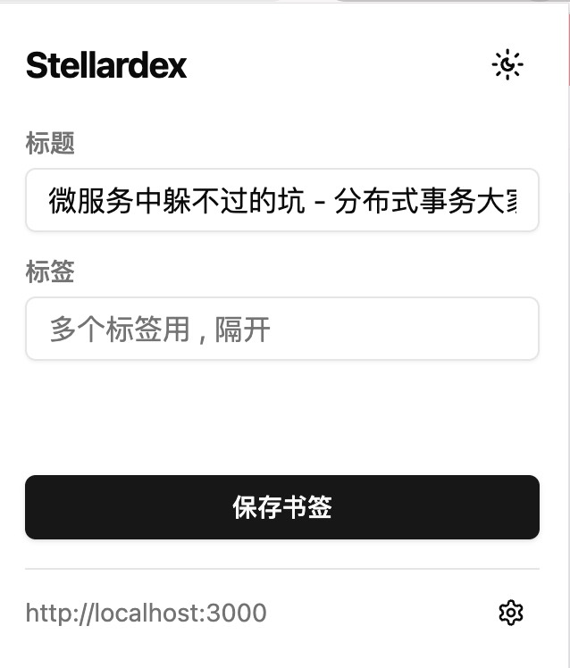

<h1 align="center">StellarDex Browser Extension</h1>

  简体中文 ｜ <a href="./README_EN.md"> English </a>

## 简介
stellardex-browser-extension 是一个浏览器扩展， 主要提供书签保存功能。

## 支持平台

- Chrome

## 预览

  &nbsp;&nbsp;
  

## 安装

1. 从 Release 页面下载最新版本的压缩包
2. 打开 Chrome 浏览器
3. 访问 `chrome://extensions/`
4. 开启右上角的「开发者模式」
5. 点击「加载已解压的扩展程序」
6. 选择项目目录

## 许可证
MIT License