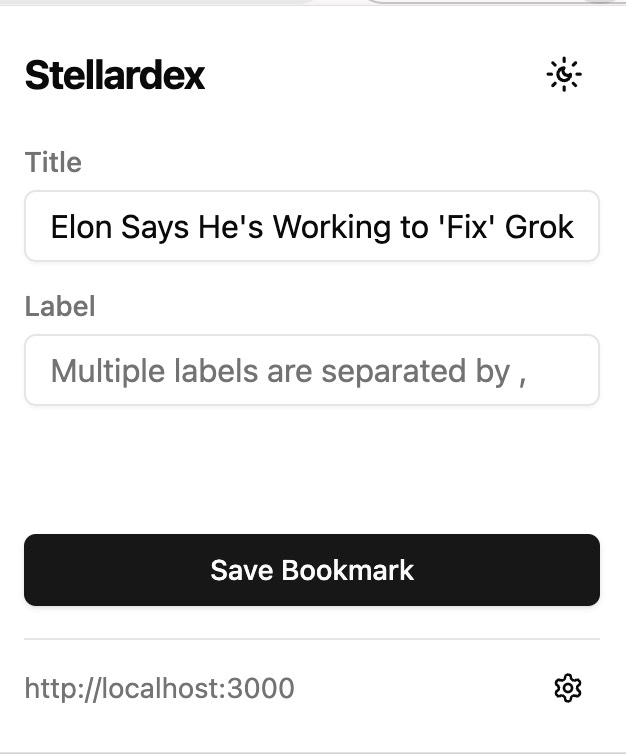
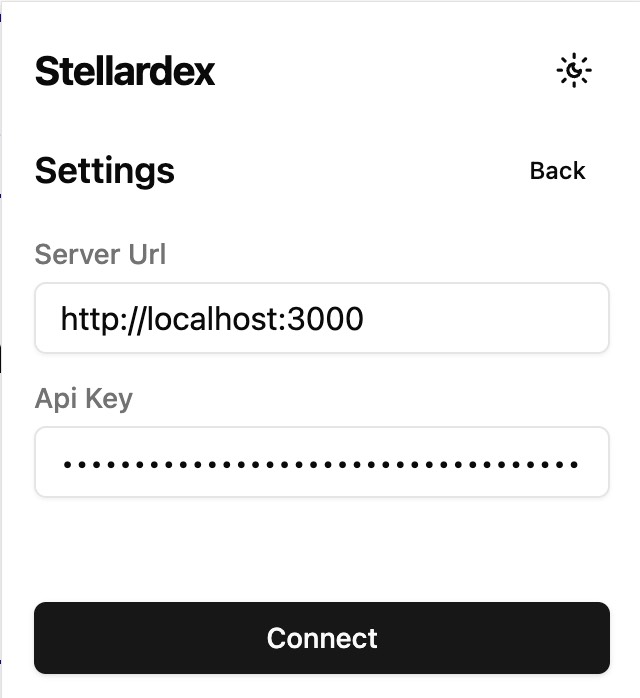

<h1 align="center">StellarDex Browser Extension</h1>

  <a href="./README.md"> 简体中文 </a> ｜ English 

## Introduction
stellardex-browser-extension is a browser extension, mainly provide bookmark saving function.

## Supported Platforms

- Chrome

## Preview

  &nbsp;&nbsp;
  

## Install

1. Download the latest version of the compressed package from the Release page.
2. Open the Chrome browser.
3. Visit `chrome://extensions/`.
4. Enable the developer mode in the top right corner.
5. Click the `Load unpacked` button.
6. Select the project directory.

## License
MIT License
